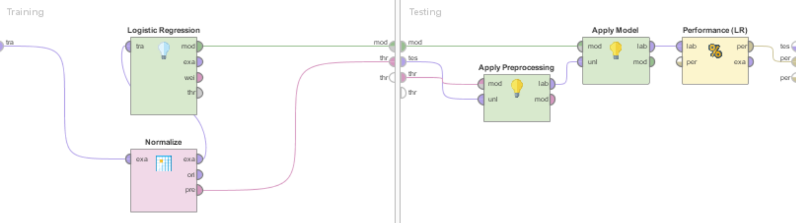
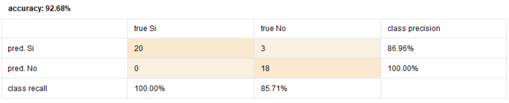
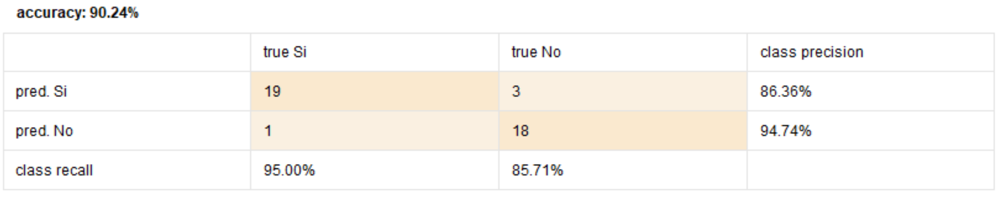
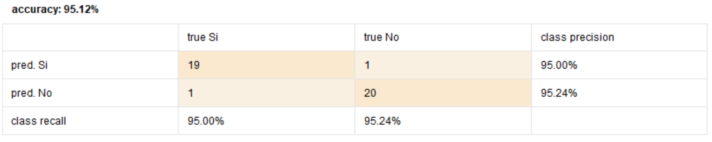
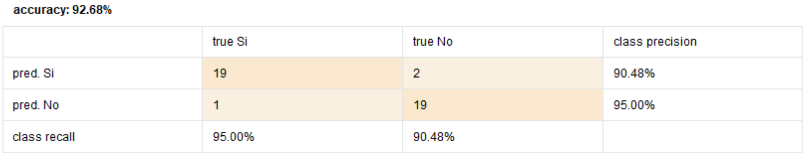

# UT3-TA4 Evolucionado

# Análisis del problema

El problema que se plantea en este documento consiste en determinar el riesgo que tiene un paciente de sufrir un segundo ataque cardíaco utilizando la información histórica de un gran número de pacientes.

La mayoría de los ataques cardíacos son provocados por un coágulo que bloquea una de las arterias coronarias. Las arterias coronarias llevan sangre y oxígeno al corazón. Si el flujo sanguíneo se bloquea el corazón sufre por la falta de oxígeno y las células cardíacas mueren.

Dentro de los factores que aumentan el riesgo de sufrir un ataque cardíaco repentino se encuentran los antecedentes familiares de enfermedades coronarias, tabaquismo, presión arterial alta, colesterol en sangre alto, obesidad, diabetes, llevar un estilo de vida sedentario o  beber demasiado alcohol.

# Datasets utilizados

Para la resolución de este problema se utilizaron dos datasets, uno para entrenar el modelo (cardiac-training.csv) y el restante para predecir el riesgo que tienen algunos pacientes de muestra (cardiac-scoring.csv). Ambos se encuentran disponibles para su descarga en este [enlace](cardiac.zip).

## Dataset de entrenamiento
El dataset cardiac-training.csv está compuesto por 138 ejemplos y 8 atributos. Estos últimos se detallan a continuación:

| Atributo | Descripción |
| -------- | ----------- |
| Edad | Edad en años del paciente redondeada al entero más cercano |
| Estado_civil | Estado civil de la persona, siendo: 0=soltero; 1=casado; 2=divorciado y 3=viudo |
| Sexo | Sexo de la persona: 0=femenino; 1=masculino |
| Categoria_Peso | Peso de la persona, categorizado en uno de tres posibles niveles: 0=normal; 1=sobrepeso; 2=obeso |
| Colesterol | Nivel de colesterol de la persona |
| Manejo_stress | Indica si el paciente ha participado de cursos de manejo del estrés: 0=no; 1=sí |
| Trat_ansiedad | Valor entre 0 y 100 indicativo del nivel natural de estrés de cada persona y de su habilidad para manejar este estrés. Un valor de 0 indicaría que la persona nunca siente ansiedad, presión o estrés en ninguna situación, mientras que un valor de 100 indicaría que la persona vive en un estado continuo de sobrecarga e incapaz de lidiar con su situación |
| 2do_Ataque_Corazon | Variable objetivo o de predicción. Este atributo contiene “sí” para aquellos individuos que han sufrido un segundo ataque cardíaco, y “no” en caso contrario |

## Dataset de scoring
El dataset de scoring está compuesto por 690 registros con los mismos atributos del dataset de entrenamiento, con la excepción del último atributo (2do_Ataque_Corazon). La ausencia de este atributo se debe a que las personas que se encuentran representadas en el dataset no saben si van a sufrir un segundo ataque al corazón.

# Preparación previa de los datos

En primer lugar, se importó el dataset de entrenamiento a la herramienta elegida para entrenar el modelo (RapidMiner). Una vez importado el dataset, se lo agregó a la vista de diseño para comenzar con la preparación de los datos. Para esta acción se utilizó el operador “Retrieve”.

En segundo lugar, se utilizó el operador “Nominal to Binomial” para cambiar el tipo del atributo 2do_Ataque_Corazon. Esta acción se debe a que dicho atributo solo tiene dos valores posibles (Sí / No) y la herramienta lo reconocía como polinomial. Además,  se marcó dicho atributo como la variable a predecir utilizando el operador “Set Role”.

.PNG "Preprocesamiento")

Por último, se utilizó el operador “Normalize” para normalizar los datos debido a la variabilidad que existía entre los valores de los diferentes atributos. Un detalle no menor es que, con el objetivo de evitar la contaminación, esta operación se realizó dentro del operador “Cross Validation”, utilizado para evaluar la performance de las diferentes alternativas manejadas para entrenar el modelo.

# Alternativas manejadas

Dado que el problema es supervisado, de clasificación y todos los atributos de entrada son numéricos, se manejaron 8 algoritmos para entrenar el modelo. A continuación se detallan los resultados y la configuración de cada uno:

>  **NOTA:** Para entrenar los modelos se utilizó el 70 % del dataset de entrenamiento. El resto se utilizó para evaluar el modelo y de esta forma descartar posible overfitting.

> Para evaluar la performance de las alternativas se utilizó el operador “Cross Validation” configurado con 10 folds, sampleo automático y semilla local (1992).

## Logistic Regression

**DETALLE:** Configuración por defecto

## LDA

**DETALLE:** Configuración por defecto

## K-NN

**DETALLE:** Configurado con K = 3, voto por peso activado y distancia euclideana como función de distancia

## Naive Bayes

**DETALLE:** Configuración por defecto

## Decission tree

**DETALLE:** Configuración por defecto

## SVM

**DETALLE:** Configurado con kernel radial, C = 0 y opción de escala desactivada

## Random Forest

**DETALLE:** Configurado para construir 100 árboles

## Vote

**DETALLE:** Configurado con Decission tree, Naive Bayes y LDA dentro del subproceso. La configuración de los algorítmos antes mencionados es la misma que usaron por separado

# Modelo utilizado

Luego de analizar la performance de cada alternativa se puede concluir los siguiente:

* Todas las alternativas tuvieron un buen desempeño, superando los 90 % de confianza, con una varianza máxima de 5 %.

* A pesar de la paridad de las alternativas, el modelo entrenado con el algoritmo SVM se destacó con 95.12 % de confianza, por tanto, este fue el modelo elegido.

> Para ver las predicciones realizadas utilizando el modelo entrenado con SVM sobre el dataset de scoring haga click sobre el siguiente [enlace](cardiac-scoring (1).xlsx).

Enlaces
### [Descargar Modelo Rapidminer](UT3-TA4.rmp)

nota: Haga click derecho sobre el link, luego descargue archivo enlazado, y borre la extension .txt
