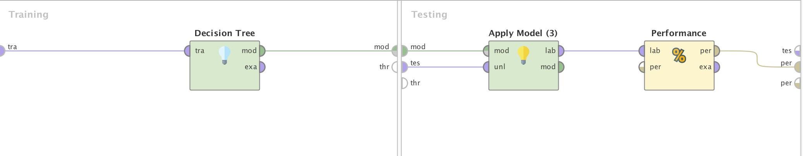

# _**eReader campaña de marketing**_

- ## Análisis del problema

    Una compañía de venta de dispositivos móviles en línea, esta apunto de lanzar un nuevo producto (eReader), y desea maximizar la efectividad de su marketing para el producto.
    A traves de datos de el comportamiento de los clientes en el sitio web , se pretende detectar que clientes van a comprar el nuevo producto apenas salga, quienes en un corto tiempo y quienes lo harán más tarde.

- ## Datasets utilizados

  Para la resolución de este problema se utilizaron dos datasets, uno para entrenar el modelo (eReader_Training.csv) , el cual contiene 661 instancias y 11 atributos.
  Luego para predecir a las actitudes buscadas en los clientes tenes el dataset (eReader_Scoring.csv) , con 473 ejemplos y 10 atributos. Ambos se encuentran disponibles para su descarga en este [Link1](eReader_Scoring.csv) - [Link2](eReader_Training.csv).

    ### Atributos

    - **ID**:  identificador único del cliente, numérico
    - **Edad**: la edad en años redondeada al entero más cercano.
    - **EstadoCivil**: “C” para los casados, “S” para todas las otras alternativas.
    - **Sexo**: F = femenino; M= masculino.
    - **ActividadWebsite**: refleja el nivel de actividad en el sitio web: Escasa, Regular o Frecuente
    - **MiroElectronicos12**: indica si la persona hay mirado o no productos electrónicos en el sitio de la compañía (SI / NO) en el último año
    - **ComproElectronicos12**: indica si la persona ha comprado o no productos electrónicos en el sitio de la compañía en el último año (SI / NO)
    - **ComproMedios18**: indica si la persona ha comprado o no productos digitales (ej: MP3) en el sitio de la compañía en el último año y medio (SI / NO).
    - **ComproLibrosDigitales**: Indica si el cliente alguna vez compró libros digitales, no se restringe sólo al último año.
    - **MetodoPago**: la forma más frecuente en que el cliente ha efectuado sus pagos:
      - Transferencia bancaria
      - CuentaWebsite – el cliente ha dispuesto una tarjeta de crédito o cuenta bancaria para débito automático en el sitio
      - TarjetaCredito – el cliente ingresa los datos de la tarjeta y autorización en cada compra o - DebitoMensual – el cliente realiza compras regularmente y recibe una factura que puede abonar mensualmente
    - **AdopcionEReader**: este atributo existe sólo en el dataset de entrenamiento. Tiene los datos de los clientes que han comprado eReaders de generaciones anteriores. Los que compraron dentro de una semana del lanzamiento son registrados como “Innovadores”. Los que compraron entre una y tres semanas luego del lanzamiento, se registran como “AdoptanteTemprano”. Luego de tres semanas, pero dentro de los primeros 2 meses, se consideran “MayoriaTemprana” y los demás, “MayoríaTardía”.  Este atributo servirá como etiqueta al aplicar el modelo al dataset de evaluación.

- ## Preparación previa de los datos

  En primer lugar, se importó el dataset de entrenamiento a la herramienta entrenar el modelo (RapidMiner). Una vez importado el dataset, se lo agregó a la vista de diseño para comenzar con la preparación de los datos. Para esta acción se utilizó el operador “Retrieve”.

  En segundo lugar, se utilizó el operador "set Role" para asignar el atributo que sería considerado el label o variable a predecir. Luego con mismo operador seteamos al valor Id de los datos, como el ID de la nueva tabla importada.

  Se hizo también el primer y segundo paso para el dataset de scoring, quitando la parte de asignación del predictor ya que es lo que se quiere encontrar

  Para finalizar, se utilizó la herramienta "multiply” para hacer la repetición de los datos, para todas las pruebas que vamos a mencionar posteriormente

  Imagen del proceso:
  

- ## Modelos utilizados

  Para este problema se implementaron , dos arboles de decision distintos con el fin de verificar cómo quedaría la construcción de esos árboles, y luego evaluar perfomance.
  Para evaluar la performance de las alternativas se utilizó el operador “Cross Validation” configurado con 10 folds, sampleo automático y semilla local (1992).

  El primer modelo creado , es un arbol de decision con ganancia de informacion como criterio de construcción , la cual se obtiene calculando las entropías de los distintos atributos.

  Luego definimos la profundidad de un árbol (maximal depth) con un valor 20, aplicamos poda con un nivel de confianza del 25% , al igual que también se agregó pre pruning.Este parámetro especifica si un criterio de parada en profundidad máxima se deben utilizar durante la generación del modelo de árbol de decisión.
  Con los valores para minimal_gain,minimal_leaf_size,minimal_size_for_split, number_of_prepruning alternatives de 0.1, 2, 4 y 3.

  El segundo modelo ,y en el cual se aplicó el estudio de la performance ,fue un arbol de decision con gini index como criterio. Este índice es una medida de la desigualdad entre las distribuciones de las características del predictor. La división en un atributo elegido resulta en una reducción en el índice promedio gini de los subconjuntos resultantes.
  La profundidad del árbol también se definió el 20 , y en este caso no se aplicó ni pruning ni pre pruning.

  Imagen del modelo:
  
  
  

- ## Resultado

  Imagen matriz de cofuncion
  

  Como se ve en la imagen se obtuvo un fiabilidad de modelo del 50% , valor que no es malo , pero tampoco es de los esperados para el modelo. Verificando otras posibilidades, como modificar los criterios de contruccion del arbol ,no se obtuvieron resultados con grandes cambios.

- ## Enlaces
### [Descargar Modelo Rapidminer](https://raw.githubusercontent.com/ucu2017-ml-grupo1/Machine-learning/master/UT4_Arboles_Decision/eReader.rmp)

nota: Haga click derecho sobre el link, luego descargue archivo enlazado, y borre la extension .txt
