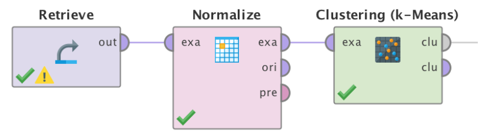
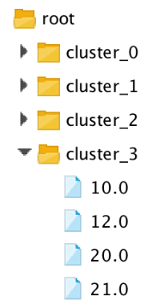
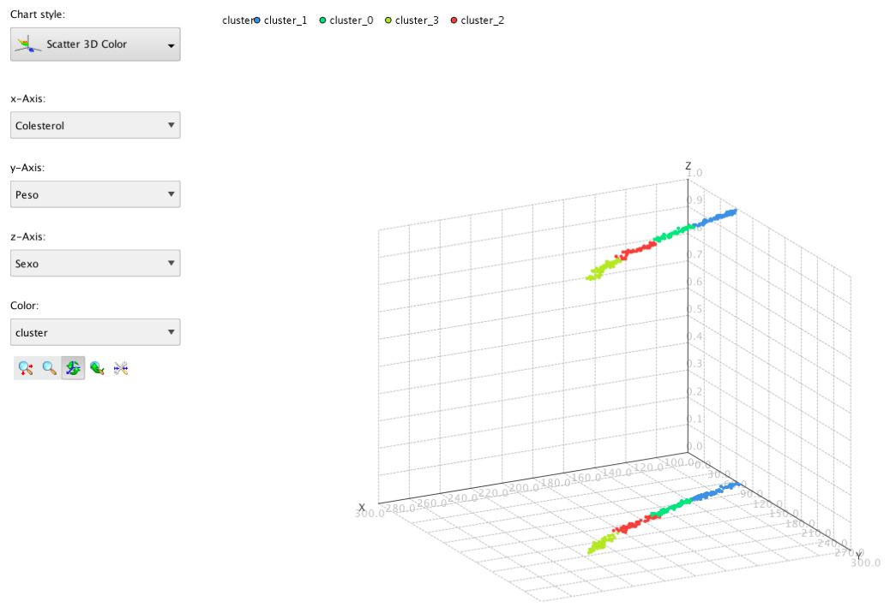

# Problema				
La Dra. Martínez es directora de programa para una gran empresa de seguros médicos. Recientemente ha visto una cantidad de investigaciones que ponen gran énfasis en la influencia del peso, sexo y colesterol en el desarrollo de enfermedad coronaria.

A efectos de decidir qué tipos de medidas preventivas recomendar a sus pacientes, piensa si no habrá grupos naturales de individuos que tengan más riesgo por alto colesterol o peso, y en caso de que estos grupos existan, dónde estarían las fronteras que los separan.

Se trata de un problema de agrupación no supervisado en el que se intenta descubrir grupos de individuos para que el experto pueda descubrir características en común y analizar cada grupo.

# Modelo de agrupación: k-Means
Se estudiará la utilidad del modelo de agrupación k-Means para la resolución de este problema. k-Means se basa en encontrar k subconjuntos de datos relacionados entre sí según algún criterio de similitud, donde cada ejemplo del dataset será asignado a un sólo grupo. El método comienza asignado k puntos que se encuentren considerablemente separados a distintos grupos. Se toman como posibles centroides de cada grupo y se asignan todos los ejemplos al grupo correspondiente al centroide más cercano. Se vuelve a repetir el proceso tantas veces como sea configurado y de esa forma se obtienen los k subconjuntos.

# Descripción del dataset
Se trata de un dataset construído por la Dra. Martínez a partir de la información de historias clínicas de 547 pacientes, de las cuales ha extraído los tres atributos que ella considera relevantes para el estudio.

- Peso: el peso en libras del paciente.
- Colesterol: último nivel de colesterol registrado de la persona.
- Sexo: 0 para femenino, 1 para masculino.

Por tratarse de un método basado en distancias se observa que es muy importante normalizar (centrar y escalar) los datos previo a la aplicación.

# Aplicación

Si bien el método es sensible a la presencia de outliers o valores faltantes, el dataset no presenta esos problemas, por lo que la etapa de preprocesamiento se reduce únicamente a la normalización de los datos.

El parámetro más importante a configurar para la aplicación del método es el número k. En este caso, la Dra. Martínez estableció previamente que existen cuatro grupos en los que se puede clasificar a los individuos. En caso de no contar con un experto que pueda ayudar a determinar este parámetro es necesario probar con varios valores y analizar las agrupaciones que se generan a partir de ello.

# Resultados
Los resultados del proceso son presentados en dos formas, primero se presenta la cantidad de ejemplos pertenecientes a cada conjunto generado, y luego se presenta una vista de carpetas donde se pueden ver cuáles son los ejemplos de cada grupo.

Vista de cantidad de elementos por cluster:
- Cluster 0: 139 items
- Cluster 1: 129 items
- Cluster 2: 132 items
- Cluster 3: 147 items
- Total number of items: 547

Vista de elementos en cada cluster (cada número es el id generado para el ejemplo):

Visualización gráfica de los datos agrupados:

Enlaces
### [Descargar Modelo Rapidminer](https://raw.githubusercontent.com/ucu2017-ml-grupo1/Machine-learning/master/UT5-kMeans/k-Means.rmp)

nota: Haga click derecho sobre el link, luego descargue archivo enlazado, y borre la extension .txt
