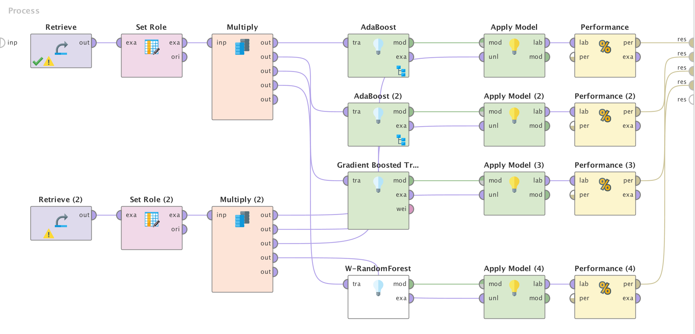

# Análisis del problema

El planteo original del problema plantea la necesidad de crear un algoritmo de machine learning capaz de clasificar áreas poligonales en imágenes satelitales con un label de acuerdo a su condición. Los label son: impervious (impermeable), farm (granja), forest (bosque), grass (pasto), orchard (huerta), water (agua). Este problema es, por lo tanto, un problema de clasificación.

Para este trabajo de plantea la utilización de métodos de diferentes métodos de ensamble basados en árboles con el objetivo de comparar el rendimiento de los distintos métodos en este problema.

# Datasets utilizados

Para desarrollar el modelo para este problema se cuenta con un dataset formado por:
1.	Imágenes satelitales con serie de tiempo (time-series) de Landsat de los años 2014 y 2015.
2.	Polígonos georeferenciados por crowdsourcing con etiquetas de cubierta terrestre (atributo label) obtenidas de OpenStreetMap.

Los polígonos mencionados anteriormente cubren solo una pequeña parte del área de la imagen y se utilizan para extraer datos de entrenamiento de la imagen, para luego clasificar el resto de la misma.

Se cuenta con 2 datasets disjuntos:
-	De entrenamiento: contiene la información para el entrenamiento.
-	De test: para utilizar en el proceso de evaluación de la precisión del modelo construido con el dataset anterior. Este dataset no contiene ningún error de valores en la clase label.

## Información de los atributos

| Atributos               | Descripción   |                                                                                       
|-------------------------|----------------------------------------------------------------------------------|
| class                   | Clase de cobertura terrestre.          |                                                              
| max_ndvi                | Máximo valor de NDVI* obtenido de las,imágenes satelitales en la serie de tiempo cubierta. |          
| 20150720_N - 20140101_N | Valores de NDVI obtenidos de las imágenes,satelitales obtenidos entre enero de 2014 y julio de 2015. |

*NDVI (normalized difference vegetation index): indicador gráfico que se usa para analizar mediciones de detección remota y evaluar si el objetivo que se observa contiene vegetación verde viva o no.

# Preparación previa de los datos
Debido a que los algoritmos a utilizar están basados en métodos de árboles, no se detectan actividades de preparación de los datos necesarias a realizar.

Tampoco es necesario la definición de estrategias de validación y división del dataset de entrenamiento ya que se cuentan con 2 datasets disjuntos, donde se utilizará uno exclusivamente para entrenar el modelo y otro para validarlo.

# Algoritmos utilizados
-	AdaBoost con un Decision Tree
-	AdaBoost con Decision Stump
-	Gradient Boosted Trees
-	Random Forest (implementación de Weka)

# Modelo utilizado

# Resultados obtenidos

| Algoritmo                              | Precisión |
|------------ |-----------|
| AdaBoost con un Decision Tree          | 52,33%    |
| AdaBoost con Decision Stump            | 36.67%    |
| Gradient Boosted Trees                 | 59,33%    |
| Random Forest (implementación de Weka) | 61,33%    |
